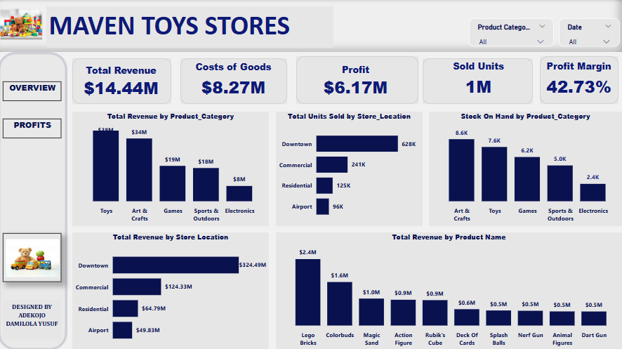
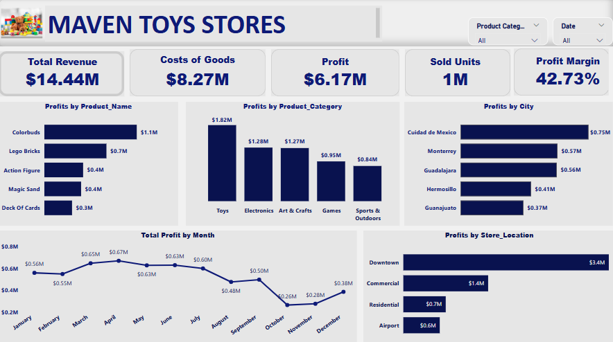

![] (ma intro.png)

## ABSTRACT
The research works is aims to analyze Sales Performances, Total Revenue Generated and Profit made across different product categories, product name, stock at hand, store by location during the sales period.
![] (ma dash 1.png)

## INTRODUCTION

**BACKGROUND HISTORY**

Maven Toys is a fictitious chain of toy stores based in Mexico, catering to a diverse customer base with a wide variety of products ranging from Toys and Games to Arts & Crafts. Established as a family business, Maven Toys has expanded over the years into multiple locations, becoming a key player in the toy industry. The company aims to provide high-quality and affordable products that foster creativity, fun, and education for children.
The toy industry in Mexico is a significant part of the retail market, influenced by key factors such as:
1.	Demographics: A young and growing population has consistently driven demand for toys and games.
2.	Seasonality: Sales often peak during holidays, especially around Christmas, Día de Reyes (Three Kings’ Day), and Children’s Day.
3.	Competition: With the rise of e-commerce and international players entering the market, competition has grown significantly.
4.	Economic Shifts: Variations in disposable income and exchange rates impact consumer purchasing power.

**Problem Statement**

Maven Toys, a leading toy retailer in Mexico, faces challenges in optimizing its sales performance, inventory management, and profitability in a highly competitive and dynamic market. Despite offering a wide variety of products across categories such as Toys, Games, and Arts & Crafts, the company struggles with:
1.	Profitability Variability: Understanding which products and categories generate the highest profit margins and identifying underperforming products.
2.	Inventory Inefficiencies: Managing stock levels effectively to avoid overstocking or stockouts, which can lead to financial losses or customer dissatisfaction.
3.	Sales Trends and Patterns: Identifying seasonality, pricing trends, and consumer preferences to enhance sales strategies.

**OBJECTIVES**

The research aims to analyze the sales performance across different product categories and inventory data of Maven Toys to address operational challenges, improve profitability, and guide strategic decision-making. Maven Toys can make informed decisions to enhance operational efficiency, improve customer satisfaction, and maintain a competitive edge in the Mexican toy retail market.

## DATA DESCRIPTION

**-DATA SOURCE:** 
The was gotten from Maven Analytics Data Playground and focus in toys sales.

**-Data collection:** 
The data was an excel.csv file and was imported into Power BI Desktop.

**Data Characteristics:**
**Description:**

The data consists of multiple tables such as products, sales, inventory, calendar, stores and data dictionary. The products table consist of 35 rows and 5 columns. Sales table consist of 829,262 rows and 3 columns. Inventory table consist of 1,593 rows and 3 columns. Calendar table had 638 rows. Store table consist of 50 rows and 5 columns. The data dictionary consists of 19 rows and 3 columns.

**Table	Field	Description**

Products	Product_ID	Product ID

Products	Product_Name	Product name

Products	Product_Category	Product Category

Products	Product_Cost	Product cost ($USD)

Products	Product_Price	Product retail price ($USD)

Inventory	Store_ID	Store ID

Inventory	Product_ID	Product ID

Inventory	Stock_On_Hand	Stock quantity of the product in the store (inventory)

Stores	Store_ID	Store ID

Stores	Store_Name	Store name

Stores	Store_City	City in Mexico where the store is located

Stores	Store_Location	Location in the city where the store is located

Stores	Store_Open_Date	Date when the store was opened

Sales	Sale_ID	Sale ID

Sales	Date	Date of the transaction

Sales	Store_ID	Store ID

Sales	Product_ID	Product ID

Sales	Units	Units sold

Calendar	Date	Calendar date
 

## METHODOLOGY

**Data Cleaning:**

Data cleaning was done on the datasets, whereby all the datasets are errors free and its validity is 100%.

To perform data cleaning and preparation of the Maven Toys Sales datasets in Power BI Desktop, follow these steps:

1. Import the Dataset.
   
•	Step 1: Open Power BI Desktop

•	Step 2: click on get data from home tab.

•	Step 3: Then click on Text/CSV icon.

•	Step 4: Then import your CSV files dataset.

•	Step 5:  Click on Transform Data.

 

3. Data Modelling
   
The model views show the relationship between the tables and how the tables columns are related together using the primary key, with the cardinality of many to one.

## ANALYSIS

**Analysis Questions**

1. Find the total revenue, total profit and costs of goods.
   
Total Revenue = SUM('products'[Product_Price])* ('sales'[TOTAL UNITS SOLD])

Total Revenue = SUM('products'[Product_Price])* ('sales'[TOTAL UNITS SOLD])

Total Costs = sum('sales'[Cost])

Profits = ([Total Revenue 2] -[Total Costs])

Profit Margin = [Profits]/ [Total Revenue 2] 

 
3. Find the products total revenue by category.

 
4. How many units was sold in the store’s location.
 

5. What is the profit margin by products category.
 

6. Find the profit made monthly.
 

## RESULTS
**Results from Maven Toys Store Analysis**

The results of the analysis provided that Maven Toys provided valuable insights into the company's sales performance, inventory management, and profitability. The analysis addressed key challenges and identified opportunities for strategic growth in the competitive toy retail market.

1. Profitability Category Insights
Profit by product categories shows that toys earned the profit most with about $1.82M, while Electronics and Art & Crafts are very close along with each other with $1.28M and $1.27M. Games is about $950K and the least among the Categories is Sports & Outdoors which was about $824K.

 However, high-margin products, such as action figures and board games, drive profitability in key categories like Toys and Games. The Colorbuds made a profit of $1.1M followed by Lego Bricks $700k. While low-margin products, such as those in the Art & Crafts category, require price adjustments or cost reduction strategies to improve profitability. 
  

3. Category Performance
Toys dominate sales in terms of revenue, while Games maintain steady demand throughout the year. The Art & Crafts category, though smaller, has potential for growth, especially with increased marketing efforts.
 

4. Seasonal Sales Trends
Sales peak during holidays like Christmas and Children’s Day. Maven Toys hits its sales peak from March to April which maintains its profit in the range of $645K to $668K. While the month with least sales of the year was October and the profit was $264K. 

 

## DISCUSSION
**INTERPRETATION OF RESULTS**

 
 
 

From the above dashboard, we can deduce that the total revenue earned by maven toys stores was from toys products category which was about $38M and the toys that was purchased most was Lego Bricks which was about $2.8M followed by Magic Sand which was about $1M. The Downtown was the location with the highest sales $324M and the airport is the location with the least sales $49M.

 
Sales peak during holidays like Christmas and Children’s Day. Maven Toys hits its sales peak from March to April which maintains its profit in the range of $645K to $668K. While the month with least sales of the year was October and the profit was $264K. The city of Cuidad de Mexico had more patronage with the highest profit by city. 

## CONCLUSION

•	High-margin products, such as action figures and board games, drive profitability in key categories like Toys and Games. While low-margin products, such as those in the Art & Crafts category, require price adjustments or cost reduction strategies to improve profitability. The downtown is the location with the highest profit which made about $3.4M.

•	Toys dominate sales in terms of revenue, while Games maintain steady demand throughout the year. The Art & Crafts category, though smaller, has potential for growth, especially with increased marketing efforts.

•	Sales peak during holidays like Christmas and Children’s Day. Maven Toys hits its sales peak from March to April which maintains its profit in the range of $645K to $668K. While the month with least sales of the year was October and the profit was $264K. 
The research on Mexico Toy Sales for Maven Toys provided valuable insights into the company's sales performance, inventory management, and profitability. The analysis addressed key challenges and identified opportunities for strategic growth in the competitive toy retail market. 

## RECOMMENDATION

•	Optimize Pricing Strategies: Focus on optimizing pricing strategies for low-margin products and promoting high-margin items to boost profitability.

•	Improve Inventory Management:  By Improving inventory management by leveraging historical sales data for more accurate forecasting.

•	Strengthen Marketing Efforts: Implement targeted marketing campaigns during peak sales periods to maximize revenue. Develop targeted campaigns around major holidays and events to boost sales during peak periods.

